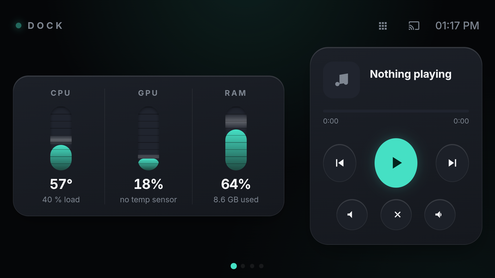

# PC Dock

Turn an old Android phone into a always-on desk dock for your Windows PC — live system monitor, media remote, and a Stream-Deck-style macro pad, served locally over your LAN. No cloud, no subscriptions.

Built to repurpose a retired phone (originally a Xiaomi Mi A1) as a permanently-mounted secondary display next to a desktop.



## Features

- **Live system meters** — CPU temp/load, GPU load, RAM usage as animated VU-style bars, read from [LibreHardwareMonitor](https://github.com/LibreHardwareMonitor/LibreHardwareMonitor)'s web server. Values glide smoothly (rAF-tweened) with a live shimmer sweep.
- **Media remote** — play/pause, next/prev, volume, mute via real Windows media keys, plus now-playing title/artist and a seek bar from the Windows Media Session API.
- **Stream Deck macro pad** — swipeable pages of buttons that launch apps, run system actions (lock, sleep), or fire keyboard hotkeys. Fully config-driven via `actions.json`.
- **Widget edit mode** — drag to reorder and drag to resize the dashboard widgets, like the Android Quick Settings editor. Layout persists on the device.
- **Native kiosk app** — a thin fullscreen Android WebView shell (`app/`) that loads the dashboard, keeps the screen awake, locks to the dock, and can one-tap launch [spacedesk](https://www.spacedesk.net/) to use the phone as an actual extended display.
- **Auto-start** — a logon script brings the whole stack up when the PC boots and wakes the phone via a MacroDroid webhook; a MacroDroid "power connected" trigger also opens the dock the moment the phone is plugged in.
- **Responsive** — adapts between portrait and landscape; dark, mission-control aesthetic.

## Architecture

```
Phone (Android WebView kiosk app)  ──HTTP──►  PC (Node server, :7777)
                                                  ├── LibreHardwareMonitor web API (sensors)
                                                  ├── PowerShell (media keys, hotkeys, system actions)
                                                  └── Windows Media Session API (now-playing)
```

The server (`server.js`) is dependency-free Node — it serves the dashboard, proxies sensor data, and executes local PowerShell scripts for control actions. The phone just renders `public/dashboard.html`.

## Requirements

- Windows 10/11 PC with [Node.js](https://nodejs.org/) and [LibreHardwareMonitor](https://github.com/LibreHardwareMonitor/LibreHardwareMonitor) (enable **Options → Remote Web Server**, port 8085).
- An Android phone on the same LAN.
- Optional: [MacroDroid](https://www.macrodroid.com/) for auto-open triggers, [spacedesk](https://www.spacedesk.net/) for extended-display mode.

## Setup

1. **Server**
   ```bash
   node server.js
   ```
   Open `http://<PC-LAN-IP>:7777` on the phone to confirm it loads.

2. **Auto-start (optional)** — copy `start-dock.example.ps1` to `start-dock.ps1`, fill in the three values (LibreHardwareMonitor path, project dir, your MacroDroid webhook), then register it in Task Scheduler as a "At log on" task with highest privileges.

3. **Native app (optional)** — the `app/` folder is a raw Android project (no Gradle). Set `DASHBOARD_URL` in `app/src/main/java/com/pcdock/kiosk/MainActivity.java` to your PC's LAN IP, then build with the Android SDK command-line tools (aapt2 → javac → d8 → zipalign → apksigner). See build steps in the commit history.

4. **Customize the macro pad** — edit `actions.json` to define your own button pages (launch / system / hotkey / script types).

## Configuration

| File | Purpose |
|---|---|
| `actions.json` | Stream Deck button pages |
| `server.js` | port, LibreHardwareMonitor URL (env: `PORT`, `LHM_URL`) |
| `start-dock.ps1` | logon startup (gitignored — holds your webhook token) |
| `MainActivity.java` | `DASHBOARD_URL` = your PC's LAN address |

## License

MIT — see [LICENSE](LICENSE).
